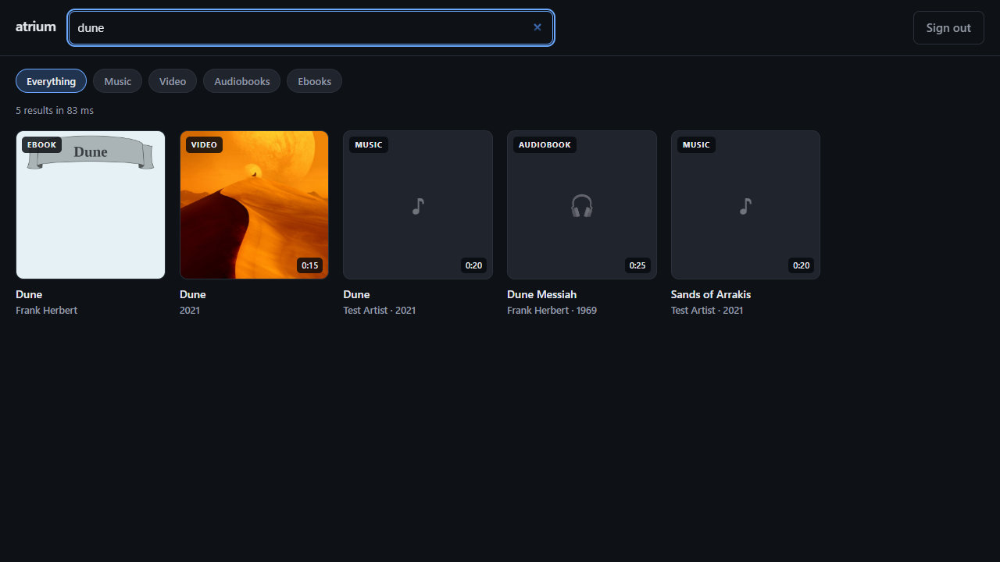
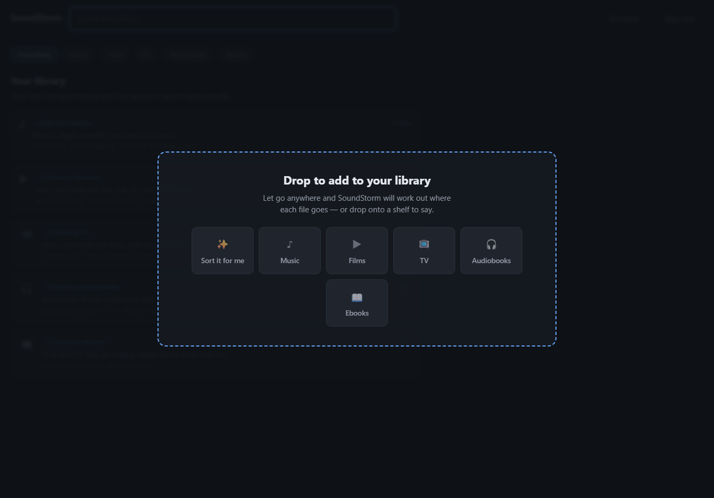
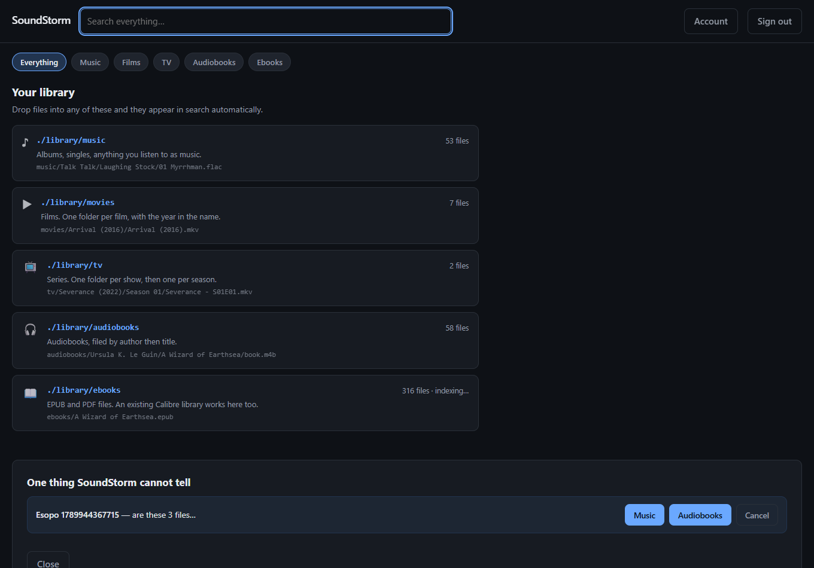
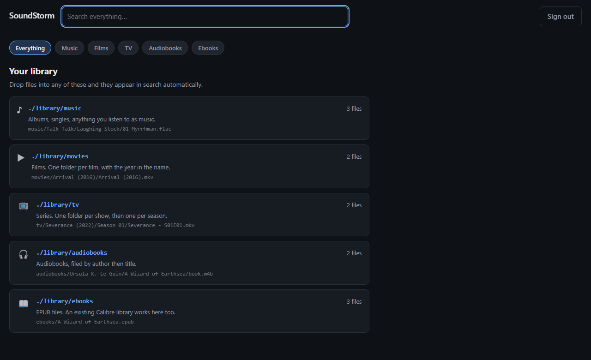
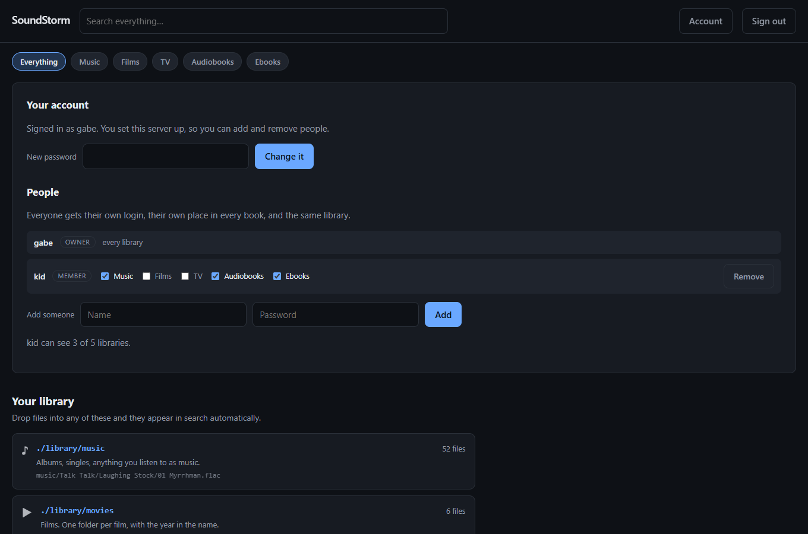

# SoundStorm

One login and one search box over your whole media library.

`docker compose up`, create an account, and put files in the folders SoundStorm
made for you. Movies, music, audiobooks and ebooks all answer the same search
and play in the same window. You never see an API key, and you never see a
second login.



## The idea

Installing self-hosted media servers is a solved problem — Umbrel, CasaOS,
Unraid and a dozen compose stacks all do it. What none of them finish is the
*integration*: you end up with four containers, four admin accounts to create,
four API keys to mint, four web UIs and four search boxes.

SoundStorm is that last mile. It runs the specialist servers, provisions their
credentials itself, and puts one interface on top:

| | |
| --- | --- |
| **Music** | Navidrome — best-in-class tag handling, fast scanner, smart playlists |
| **Films and TV** | Jellyfin — metadata, artwork, season/episode structure |
| **Audiobooks** | Audiobookshelf — author/narrator/series, per-title listening position |
| **Ebooks** | SoundStorm itself — EPUB and PDF, read in the browser |

Using the real servers instead of reimplementing them is the whole trick. When
you search "dune" and get a film back with a real poster and a real synopsis,
that is Jellyfin's metadata work, not SoundStorm's.

## Status

This is a **working vertical slice**, not a finished product. What runs today:

- one command installs it — published multi-arch images, no build step, no
  repository to clone
- SoundStorm provisions every one of them on first boot — **zero API keys typed**
- **drag and drop**: files and folders dropped on the window are sorted into the
  right library automatically
- **accounts**: the first visit creates the owner, who adds everyone else; each
  person keeps their own place in every book and sees only the libraries they
  are given
- **HTTPS** on request, with a local certificate authority so there is one
  install per device and no warning afterwards
- one search across all four, merged and ranked
- music, films, TV and audiobooks play **inside SoundStorm**
- video a browser cannot decode is **transcoded by Jellyfin on the fly** and
  served as HLS, so HEVC, MKV and DTS play *and seek* like anything else
- **subtitles**, embedded or sidecar, converted to WebVTT and selectable
- ebooks are **read inside SoundStorm**, and remember where you stopped
- no backend publishes a port; SoundStorm is the only door

See [docs/roadmap.md](docs/roadmap.md) for what is not built yet.

## Install it

You need [Docker](https://www.docker.com/products/docker-desktop/) — that is
the only thing. It is free for personal use and installs like any other app.

Then one command:

**macOS / Linux**

```sh
curl -fsSL https://raw.githubusercontent.com/gabehollberg/soundstorm/main/install.sh | sh
```

**Windows** — download
[SoundStorm-Setup.cmd](https://raw.githubusercontent.com/gabehollberg/soundstorm/main/SoundStorm-Setup.cmd)
and double-click it. Nothing to install first and no terminal to find: if
Docker is missing it installs that too, and if it is not running it starts it.

<details>
<summary>Windows, from PowerShell instead</summary>

```powershell
irm https://raw.githubusercontent.com/gabehollberg/soundstorm/main/install.ps1 | iex
```

</details>

That downloads about 3GB of media servers, starts them, finds a free port if
8099 is busy, and opens your browser when it is ready. Pick a username and
password on the first screen and you are in. **You will never see an API key,
a config file, or a second login.**

On Windows it also leaves a **SoundStorm icon on the desktop** and starts with
the PC, so after the first time it is one click — and a **SoundStorm media**
folder shortcut for dropping files in. Windows may warn that the file is from
an unknown publisher the first time: *More info → Run anyway*.

<details>
<summary>Prefer to do it by hand?</summary>

The installer is a convenience, not a requirement — it downloads one file and
runs one command. You can do the same:

```sh
mkdir soundstorm && cd soundstorm
curl -fsSL https://raw.githubusercontent.com/gabehollberg/soundstorm/main/docker-compose.yml -o docker-compose.yml
docker compose up -d
```

Then open <http://localhost:8099>. To run it on a different port, put
`SOUNDSTORM_PORT=9000` in a `.env` file beside the compose file.

</details>

### Where your media goes

SoundStorm makes a `library/` folder next to the compose file, and the app's
first screen is a guide to it:

```
library/
  music/       Talk Talk/Laughing Stock/01 Myrrhman.flac
  movies/      Arrival (2016)/Arrival (2016).mkv
  tv/          Severance (2022)/Season 01/Severance - S01E01.mkv
  audiobooks/  Ursula K. Le Guin/A Wizard of Earthsea/book.m4b
  ebooks/      A Wizard of Earthsea.epub, Some Paper - Author (2017).pdf
```

Drop a file in the matching folder and it shows up in search. Nothing to
import, no library to configure.

**Or just drag it onto the window.** Anywhere — there is nothing to aim at.
SoundStorm works out what each file is and files it for you: a folder keeps its
structure, subtitles and artwork travel with their film, and anything it cannot
place is listed with the reason rather than dumped somewhere.



**When it genuinely cannot tell, it asks.** An mp3 is a song or a chapter of an
audiobook and nothing in the file says which, so it asks — once for the whole
folder, not once per chapter.

 Navidrome and the ebook scanner sweep every
couple of minutes; Jellyfin and Audiobookshelf watch for changes. Until a scan
catches up the app says so, rather than pretending the file is not there.



It arrives with a small library already in place — ten classics from Project
Gutenberg, Bach's Goldberg Variations, and *As a Man Thinketh* as both an ebook
and an audiobook — so there is something to search the moment it starts.
Bundled in the binary rather than downloaded, so the first run works with no
network and nobody's bandwidth but yours is involved. Delete them whenever you
like; they are ordinary files.

`library/ebooks` is a plain folder of `.epub` and `.pdf` files. It can also be
an existing Calibre library — SoundStorm reads Calibre's `metadata.opf`
sidecars, so a library you already curate keeps its series, tags and corrected
authors, with no SQLite driver and no Calibre-Web container.

### Running it

```sh
cd soundstorm
docker compose logs -f        # what is it doing
docker compose down           # stop it; your library folder is untouched
docker compose pull && docker compose up -d     # upgrade
```

Re-running the installer does the upgrade too.

### Giving other people a login

The first account is the owner. From **Account → People** the owner adds
everyone else: a name and a password, and that is the whole ceremony. There is
no open registration and no invite link, deliberately — a server that might be
reachable from outside a house should not let a stranger create an account.

Everybody keeps their own **place in every book**, both for reading and for
listening. The audiobook side of that is real per-person state on the backend,
not a note in a file: SoundStorm quietly gives each person their own
Audiobookshelf account, and removing them takes it away again along with their
sessions and bookmarks.

**Each person sees only the shelves you tick.** Music, Films, TV, Audiobooks,
Ebooks — untick Films for a child account and the tab disappears, the folder
stops being listed, search stops returning films, and the film itself returns
404 if anybody goes looking for the URL. The last one is the part that matters:
hiding results is not a permission.



What this is not: per-title or age-rating filtering. The unit is a whole
library, so "no films for the seven-year-old" is answerable and "only these
films" is not.

### Turning on HTTPS

Off by default, because on `localhost` there is nothing on the wire to protect
and a certificate warning is a poor first screen. The moment another machine
can reach it, turn it on — put this in the `.env` file beside your
`docker-compose.yml` and run `docker compose up -d`:

```sh
SOUNDSTORM_TLS=self-signed
```

SoundStorm then runs its own certificate authority. Visit
`http://<server>:8099/ca.crt`, install that file once per device, and there is
no warning again — at any address, including a bare LAN IP, including addresses
the server has never seen. Certificates are minted from the connection itself,
so there is nothing to configure and nothing to renew.

Already have a real certificate? `SOUNDSTORM_TLS=file` with
`SOUNDSTORM_TLS_CERT` and `SOUNDSTORM_TLS_KEY`. Behind a reverse proxy that
terminates TLS for you? Leave TLS off and set `SOUNDSTORM_TRUST_PROXY=true` so
the session cookie is marked Secure.

**Still true:** SoundStorm has not been audited, and putting any self-hosted
server directly on the open internet is a decision worth making deliberately. A
VPN such as [Tailscale](https://tailscale.com) remains the easiest safe answer.

### Windows, in more detail

Windows is a first-class target — this project is developed and tested on it.
Docker Desktop runs the same Linux images there that it runs everywhere else,
and the setup file handles the parts people get stuck on:

| | |
| --- | --- |
| Docker not installed | installs it with `winget`, no website visit |
| Docker installed but not running | starts it and waits for it |
| Port 8099 already taken | quietly uses the next free one |
| Remembering the address | desktop and Start Menu shortcuts |
| Turning the PC on | starts by itself |

What is *not* supported is running the whole stack natively without Docker.
SoundStorm's own binary does run natively on Windows, and on its own it serves
your ebooks; but films, music and audiobooks *are* Jellyfin, Navidrome and
Audiobookshelf, and running those without containers would mean SoundStorm
installing and supervising three third-party servers as Windows processes. That
is a different project, and the one thing SoundStorm is careful not to become.

## For developers

```sh
git clone https://github.com/gabehollberg/soundstorm && cd soundstorm
docker compose -f docker-compose.yml -f docker-compose.dev.yml up --build
```

The compose split is deliberate: `docker-compose.yml` names a published image
and nothing else, so it works on its own for somebody who never cloned
anything. `docker-compose.dev.yml` adds `build: .` on top.

```sh
go test ./...
pwsh scripts/make-sample-media.ps1     # a synthetic library, no downloads
pwsh scripts/fetch-test-library.ps1    # ~750MB of real public-domain media
```

## How it works

```
                            browser
                               │  one origin, one cookie
                       ┌───────▼───────┐
                       │    soundstorm     │  auth · search · player · byte proxy
                       └───────┬───────┘
      ┌──────────────┬─────────┴─────────┬──────────────┐
      ▼              ▼                   ▼              ▼
 Navidrome     Jellyfin        Audiobookshelf   library/ebooks
   :4533         :8096              :80          (a folder)
              films + TV
        — none of the three publishes a port —
```

Jellyfin appears twice: films and series are separate Jellyfin libraries, with
different scrapers and different structure, so they are two SoundStorm sources
sharing one token. Searching a show name finds the show; searching an episode
title finds the episode.

Ebooks have no backend at all. An EPUB carries its own title, author and cover
in a documented format, and needs no transcoding, so SoundStorm reads the folder
directly. That is the line: **SoundStorm can own a media type when it is
self-describing and needs no transcoding.** Video never will be.

Three rules hold it together.

**A dead backend must never take the search down.** Every backend gets its own
deadline and its own error slot. If Jellyfin is restarting you still get your
music, and the response says which source failed and why.

**Normalization happens at the edge.** Each adapter is the only code that knows
its backend's vocabulary. Everything past it speaks `media.Item`.

**Nothing upstream ever reaches the browser.** Results carry no upstream URLs.
SoundStorm fetches media server-side and pipes it through, which is what lets the
backends stay off any published port — and therefore what makes "one login"
true rather than decorative.

That last rule reverses an earlier design decision, deliberately. See the
package comment in `internal/stream` for the cost/benefit.

## Layout

```
cmd/soundstorm/          main, env config, graceful shutdown
internal/media/      Item, Query, Kind — the shared vocabulary
internal/library/    the folder layout: creates it, counts it
internal/source/     the Source interface, Target, Registry
internal/source/*/   one package per backend (subsonic, jellyfin,
                     audiobookshelf, localbooks, opds)
internal/epub/       EPUB metadata and resource reading
internal/pdf/        PDF metadata, without parsing PDF structure
internal/provision/  first-boot credential provisioning  ← the load-bearing part
internal/state/      the little that must survive a restart
internal/auth/       single-account login, PBKDF2, sessions
internal/federate/   parallel fan-out, per-source deadlines, merge, rank
internal/stream/     media byte proxy with Range support
internal/httpapi/    handlers
internal/webui/      the embedded UI
```

## Endpoints

| Method | Path | Auth | Purpose |
| --- | --- | --- | --- |
| GET | `/` | — | the UI |
| GET | `/healthz` | — | liveness |
| GET | `/api/session` | — | does an account exist; am I signed in |
| POST | `/api/signup` | — | create the one account (first boot only) |
| POST | `/api/login` / `/api/logout` | — | |
| GET | `/api/setup` | session | per-backend provisioning progress |
| GET | `/api/library` | session | the folder layout and what is in it |
| GET | `/api/playback/{source}/{id...}` | session | how to play an item, and its subtitles |
| GET | `/api/hls/{source}/{path...}` | session | transcoded playlist and segments |
| GET | `/api/subtitle/{source}/{track...}` | session | one subtitle track, as WebVTT |
| GET | `/api/search?q=&kind=&limit=` | session | federated search |
| GET | `/api/stream/{source}/{id...}` | session | media bytes |
| GET | `/api/art/{source}/{id...}` | session | artwork |
| GET | `/api/book/manifest?source=&id=` | session | what is inside a book |
| GET | `/api/book/resource?source=&id=&path=` | session | one file from inside a book |
| GET/PUT | `/api/book/progress?source=&id=` | session | reading position |

The trailing `...` is load-bearing: an OPDS acquisition reference is a path with
slashes in it, and that is the id the adapter needs back.

`kind` is one of `music`, `video` (films), `tv`, `audiobook`, `ebook`, and may
repeat or be comma-separated. Filtering skips non-matching backends entirely.

A search always returns 200. Check `degraded` and the `sources` array.

## Adding a backend

Two halves, because a backend needs both:

1. **Search.** Implement `source.Source` in `internal/source/<name>/`, plus
   `source.Streamer` and `source.ArtProvider` if it serves bytes.
2. **Provisioning.** Add a function in `internal/provision/` that walks the
   backend's first-run flow and returns credentials, then a case in the switch
   in `provision.go` and a target in `targetsFromEnv`.

The second half is the one people skip, and it is the one that matters — a
backend a human has to configure by hand defeats the point of the project.

## Conventions

- **Zero third-party Go dependencies.** Standard library only, including
  password hashing (`crypto/pbkdf2`, stdlib since Go 1.24). There is no
  `go.sum` and the container build downloads nothing.
- **A ~22MB starter library** is embedded in the binary (`internal/starter`) and
  unpacked into empty library folders on first run. Public domain and CC0
  throughout. Set `SOUNDSTORM_STARTER_LIBRARY=false` to skip it.
- **Two vendored browser libraries**, both under
  `internal/webui/assets/vendor/`: foliate-js (MIT) renders EPUB, and hls.js
  (Apache-2.0) plays transcoded video where the browser has no native HLS. Both
  are prebuilt, pinned by content, embedded in the binary and fetched at no
  point during a build, so the properties the zero-dependency rule protects all
  survive. hls.js is 620KB, so it is loaded lazily — only when a video actually
  needs a transcoded stream, never for music, books or direct-play films.
- **No config file.** Everything comes from environment variables set by
  compose, plus state SoundStorm provisions itself. A config file is one more thing
  for a human to edit, and the goal is that a human edits nothing.
- **Fail loudly at startup, degrade gracefully at runtime.**
- `gofmt` clean, `go vet` clean, tests pass.

## Notes

- **Module path** is `github.com/gabehollberg/soundstorm`. If the repo lives
  elsewhere, fix `go.mod` and run
  `grep -rl gabehollberg/soundstorm . | xargs sed -i 's|gabehollberg/soundstorm|<you>/soundstorm|g'`.
- **No `go.sum`** and that is correct, not an oversight.
- **Serve over TLS or a private network.** Subsonic stream URLs carry
  credentials in the query string — that is the protocol, and although those
  URLs never leave SoundStorm, the session cookie still crosses the wire.
