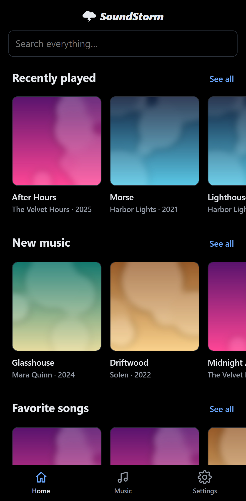
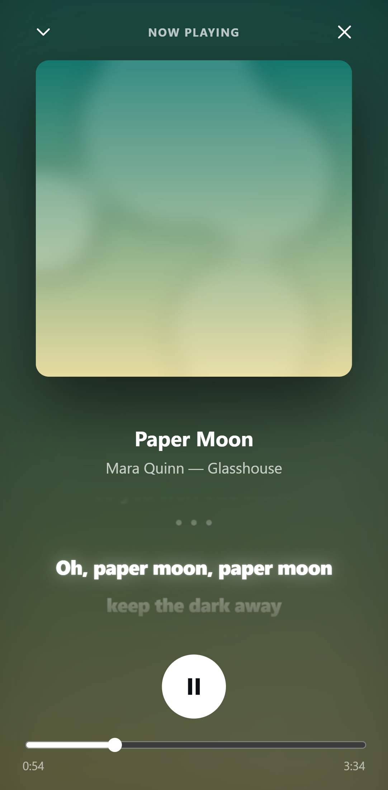
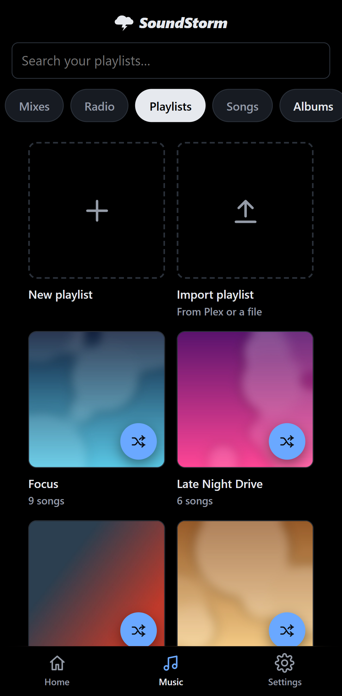
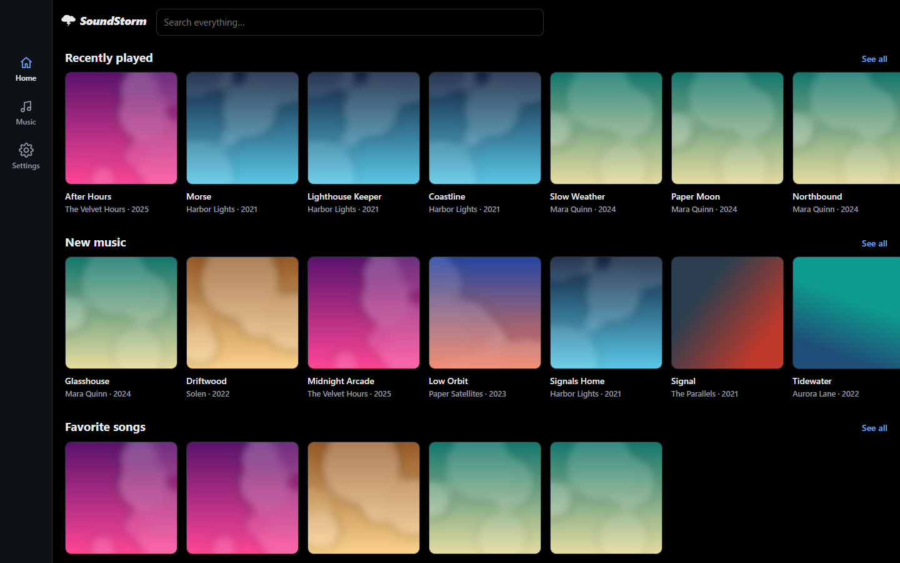

<p align="center">
  
</p>

<h1 align="center">SoundStorm</h1>

<p align="center">
  <strong>Your music, films, TV, audiobooks, ebooks and photos in one app.<br>
  One login, one search box. It runs at home on your own computer.</strong>
</p>

<p align="center">
  <a href="https://github.com/GabrielHollberg/soundstorm/releases/latest/download/SoundStorm-Setup.cmd"><strong>⬇ Download for Windows</strong></a>
  &nbsp;·&nbsp;
  <a href="#mac-and-linux">Mac and Linux</a>
  &nbsp;·&nbsp;
  <a href="docs/guide.md">User guide</a>
  &nbsp;·&nbsp;
  <a href="https://github.com/GabrielHollberg/soundstorm/releases">What's new</a>
</p>

<!-- The phone screenshots predate the Lyrics look, the play orb and Home's
     one-tap music row; they want re-taking. -->
<p align="center">
  
  &nbsp;
  
  &nbsp;
  
</p>

SoundStorm turns a computer at home into your own streaming service. Put your
files in its folders, or drag them onto the window, and they appear, sorted,
with covers, ready to play on every phone, tablet, TV and computer in the
house. There are no subscriptions, no adverts and no accounts with anybody
but yourself, and nothing to set up by hand.

## What you get

**Music**
- A proper music player: gapless playback, crossfade, even volume across songs,
  a sleep timer, and lock-screen and headphone controls.
- Synced lyrics that light up line by line, and a dozen **visualizers** that
  move with the song itself (SoundStorm listens to every track for its beats).
- **Radio** that never runs out: from any song, album or artist, by **mood**
  (Chill, Feel good, Focus, Party...) or by decade and genre. SoundStorm
  listens to your music to learn how it sounds.
- Mixes, favorites and playlists. **Import your playlists from Plex/Plexamp**,
  or from any player that saves M3U files.
- Download songs to your phone for when you're offline.
- **Your year in music**, a recap of your listening, and optional
  [ListenBrainz](https://listenbrainz.org) scrobbling.

**Films and TV**
- Plays anything, including files a browser normally can't. They are converted
  as they play.
- Subtitles, a choice of audio languages, **Continue watching**, and **Up next**
  into the next episode.
- **Picture quality** per device: the original at home, lighter away from home
  or on mobile data, changeable while you watch. Download films for the road,
  choosing the quality and language.

**Books**
- Read ebooks (EPUB, PDF) and listen to audiobooks in the app. Your place is
  kept on every device.
- Audiobooks get a table of contents, a timeline for the chapter you're in,
  thirty-second skips and a speed control.
- **Read along**: when you have a book as both an ebook and an audiobook, the
  pages turn by themselves with the narration.

**Photos**
- Browse by date, people and places. Search by what's *in* a picture ("beach",
  "dog"). iPhone HEIC photos just work.
- **Everyone has their own photos.** Each person's go in a folder of their own,
  sorted by when they were taken, and only they (and the owner) can see them.
  The owner sets how much space each person gets.
- **Back up your phone** automatically with the Android or iPhone app.
- **Bring your photos in from anywhere**: Google Photos, iCloud, Facebook,
  Instagram, Snapchat, Flickr, WhatsApp and Telegram downloads, cloud drives,
  SD cards and old computers. Dates and places are kept, and a photo you
  already have is skipped, so adding the same ones twice does no harm.

**For the whole household**
- Everyone gets their own login, with their own favorites, playlists, history
  and place in every book.
- **Who's listening?** A shared TV or tablet can keep several people: pick
  yourself instead of typing a password, with an optional PIN.
- **Sign a TV in from your phone** by scanning a QR code or typing a short code,
  instead of typing a password with a remote.
- Choose which shelves each person can see, so the kids can have no films, for
  example.
- Apps for **Android** (phones, Google TV, Android TV, Fire TV), **iPhone** and
  **Apple TV**, or install the web app on any phone with its own icon.
- Secure (HTTPS) automatically, with nothing to set up. Reaching it from outside
  the house is optional and off until you turn it on. Passwords must be strong,
  and you can make every new device wait for approval from one already signed
  in.
- The apps can remember **several servers** (yours and your parents', say) and
  switch between them.

<p align="center">
  
</p>

## What you need

| | |
| --- | --- |
| **Computer** | Windows 10 or 11, a Mac, or Linux, left switched on while you use it |
| **Memory** | 16 GB recommended; 8 GB works if you leave photos out (photo search alone wants several GB) |
| **Disk** | About 20 GB for SoundStorm itself, plus room for your media |
| **Internet** | For the first install (a large download); afterwards it runs at home |

Phones, tablets and other computers need nothing installed: they use SoundStorm
in their web browser, or add it to their home screen as an app. There are also
apps: Android (from the [releases page](https://github.com/GabrielHollberg/soundstorm/releases),
the `android-` ones, which also run on Google TV, Android TV and Fire TV),
iPhone and Apple TV.

## Install

### Windows

1. **[Download SoundStorm-Setup.cmd](https://github.com/GabrielHollberg/soundstorm/releases/latest/download/SoundStorm-Setup.cmd)**
2. **Right-click** the downloaded file → **Properties** → tick **Unblock** at the bottom → **OK**
3. **Double-click** it.

A setup window walks you through the rest. Expect **10 to 30 minutes**, mostly
downloading, and keep the window open until it says it's finished. Along the way:

- **Windows asks for permission** to install Docker (the engine SoundStorm runs
  on) and sometimes Windows Subsystem for Linux. Click **Yes**.
- **Docker Desktop opens a window of its own.** You **don't** need a Docker
  account: click **Accept**, then **Skip** on the sign-in and the questions.
  You can close that window afterwards.
- **You choose where to keep your library.** Keep the suggested folder, or pick
  one on another drive.
- **"Windows Security Alert"** for Docker Desktop Backend: click **Allow access**.
  If it asks **"Is this your home network?"**, click **Yes** at home, so your
  phone and TV can reach SoundStorm.

When it's done, your browser opens SoundStorm and there's a SoundStorm icon on
your desktop.

<details>
<summary><strong>Why the "Unblock" step?</strong></summary>

Windows blocks *every* script downloaded from the internet ("An Application
Control policy has blocked this file"). That is about the file type, not about
SoundStorm, and ticking **Unblock** is how Windows lets you say you trust it.
Skipping it is the most common reason nothing happens when you double-click.

</details>

<details>
<summary>Rather paste a command? (PowerShell)</summary>

```powershell
irm https://raw.githubusercontent.com/GabrielHollberg/soundstorm/main/install.ps1 -OutFile "$env:TEMP\soundstorm.ps1"
powershell -ExecutionPolicy Bypass -File "$env:TEMP\soundstorm.ps1"
```

</details>

### Mac and Linux

Install [Docker](https://docs.docker.com/get-docker/) first (on a Mac, Docker
Desktop), then run this in a terminal:

```sh
curl -fsSL https://raw.githubusercontent.com/GabrielHollberg/soundstorm/main/install.sh | sh
```

It downloads everything, sets it all up and prints the address to open.

<details>
<summary>Already use Docker Compose? Install by hand</summary>

```sh
mkdir soundstorm && cd soundstorm
curl -fsSL https://raw.githubusercontent.com/GabrielHollberg/soundstorm/main/docker-compose.yml -o docker-compose.yml
docker compose up -d
```

Open <http://localhost:8099>. The setup code for the first account is printed in
`docker compose logs soundstorm`. More options are in the [user guide](docs/guide.md#advanced-settings).

</details>

## Getting started

**1. Create your account.** The first screen asks for a username and password
(at least 12 characters, and not a common one); that account is the owner. If it asks for a **setup code**, it's shown at the end
of the setup window and saved in the `.env` file in your SoundStorm folder. The
code makes sure only the person who installed SoundStorm can claim it.

**2. Add your media.** Either way works:

- **Drag files or whole folders onto the SoundStorm window.** SoundStorm works
  out what each file is and files it on the right shelf. If it can't tell (an
  MP3 could be a song or an audiobook chapter), it asks once. On a phone, use
  **Settings → Add media**.
- **Or copy files into the library folders** (the desktop has a shortcut to
  them). This is best for a big collection:

  ```
  library/
    music/        Artist/Album/01 Song.flac
    movies/       Arrival (2016)/Arrival (2016).mkv
    tv/           Severance/Season 01/Severance - S01E01.mkv
    audiobooks/   Author/Book Title/book.m4b
    ebooks/       Author/Book Title/book.epub    (a Calibre library works too)
    documents/    Manuals/Dishwasher.pdf
    pictures/     2024 Holiday/IMG_4031.heic
  ```

New files show up within a minute. A song, a book and an audiobook come
included, so you can try everything straight away. Delete them whenever you
like.

**3. Put it on your phone.** Open **Settings → Use on your phone or TV** on the
computer. It shows the address to type on your phone (your phone must be on the
same Wi-Fi). Then either install the app (Android: the newest `android-` file on
the [releases page](https://github.com/GabrielHollberg/soundstorm/releases)),
which also backs up the phone's photos (the iPhone app does too), or add the web app to your home screen:
- **iPhone:** Share → **Add to Home Screen**.
- **Android:** Chrome menu → **Install app**. Use the secure address, the one
  ending in `.home.soundstorm.dev`.

**4. Add your family.** **Settings → People**: give each person a name and a
password, tick which shelves they may see, and set their photo space if you
like (100 GB each unless you change it).

**5. Bring your photos in.** **Settings → Your photos → Bring your photos in
from anywhere** shows how to download your photos from Google, Apple, Facebook
and the rest; drop the zips on the window and SoundStorm sorts them.

### Coming from Plex or Plexamp?

Your playlists can come with you. On **Music → Playlists**, tap **Import
playlist** → **From Plex or Plexamp**, sign in on Plex's own page, and pick the
playlists you want. Each song is matched to your SoundStorm library, and any
that aren't in it are listed afterwards. SoundStorm never sees your Plex
password and doesn't keep the Plex sign-in once you're done. (Your Plex server
must be switched on, and reachable from the SoundStorm computer.)

### Using it away from home

At home it works straight away. To listen from anywhere:

- **Remote access** (Settings → *Reach it from anywhere*) gives your server its own
  secure web address. SoundStorm opens the port on your router itself where
  the router allows it, and tells you exactly what to do where it doesn't.
- **[Tailscale](https://tailscale.com)** works on any internet connection, puts
  nothing on the internet, and needs the free Tailscale app on each device. On
  Windows, use **Set up Tailscale** in the Start menu.

Details are in the [user guide](docs/guide.md#away-from-home).

## Keeping it running

| | Windows | Mac and Linux |
| --- | --- | --- |
| **Update** | Start menu → **Update SoundStorm** | Run the install command again |
| **Start / stop** | The desktop icon starts it; it also starts with Windows | `docker compose up -d` / `docker compose down` in the install folder |
| **Move to a new computer** | Start menu → **Move SoundStorm to another computer** | `install.sh` with `--export` ([guide](docs/guide.md#moving-to-another-computer)) |
| **Uninstall** | Settings → Apps → SoundStorm → Uninstall | `install.sh` with `--uninstall` |

Updating keeps your library, accounts and settings. **Uninstalling never deletes
your media**: the `library` folder is left where it is.

**Back it up.** One small file holds every account and the passwords
SoundStorm made for the media servers inside it. See
[Backing up](docs/guide.md#backing-it-up). The uninstaller saves one for you
automatically.

**Forgot your password?** See [Getting back in](docs/guide.md#forgotten-your-password).

## Troubleshooting

**Nothing happens when I double-click the setup file.** Do the **Unblock** step
(right-click → Properties → Unblock), then double-click again.

**Setup says my computer can't run it (virtualization).** Docker needs
virtualization switched on in your computer's BIOS/UEFI settings, usually called
*Intel VT-x*, *AMD-V* or *SVM*. Turn it on, restart, and run the setup again.

**My phone can't open SoundStorm.**
- Make sure the phone is on the same Wi-Fi as the computer, and not a *guest*
  network.
- On Windows, run **Update SoundStorm** from the Start menu while on your home
  network: it fixes the network and firewall settings.
- Give the computer a fixed address in your router (a "DHCP reservation"), so
  the address never changes.

**The secure `.home.soundstorm.dev` address doesn't load.** Some routers block
it on purpose. SoundStorm then stays on the plain address, and everything still
works.

**A new file doesn't show up.** Give it a minute, or use **Settings → Check for
new files**. If someone else can't see it, check which shelves they're allowed
under **Settings → People**.

**Something else?** The Windows setup window has **Show log file**; send that
file along with a description when you
[open an issue](https://github.com/GabrielHollberg/soundstorm/issues).

## Privacy: what leaves your house

Your media, searches and passwords stay on your computer. SoundStorm contacts
the internet only for:

- **Its secure address.** A small name service gives your server its
  `….soundstorm.dev` name and certificate. It only knows your server's *home
  network* address.
- **Updates**, when you run them.
- **Things you switch on**, all off by default: finding missing lyrics online
  ([LRCLIB](https://lrclib.net)), artist bios and similar artists
  ([MusicBrainz](https://musicbrainz.org), [ListenBrainz](https://listenbrainz.org),
  Wikipedia), remote access, scrobbling, and importing from Plex.

## Built on

SoundStorm is the app on top. The heavy lifting is done by excellent open-source
servers, which SoundStorm installs, sets up and keeps out of your way:

| | | |
| --- | --- | --- |
| Music | [Navidrome](https://www.navidrome.org) | GPL-3.0 |
| Films and TV | [Jellyfin](https://jellyfin.org) | GPL-2.0 |
| Audiobooks | [Audiobookshelf](https://www.audiobookshelf.org) | GPL-3.0 |
| Photos | [Immich](https://immich.app) | AGPL-3.0 |
| Read along | [Storyteller](https://storyteller-platform.dev) | MIT |
| Moods and "sounds like" | [AudioMuse-AI](https://github.com/NeptuneHub/AudioMuse-AI) | AGPL-3.0 |
| Ebook reader | [foliate-js](https://github.com/johnfactotum/foliate-js) | MIT |
| Video player | [hls.js](https://github.com/video-dev/hls.js) | Apache-2.0 |

Each runs unmodified in its own container, under its own license.

## For developers

How it fits together, how to build it and how to add a backend:
[docs/developers.md](docs/developers.md).

**How SoundStorm works, in depth:** the [`site/`](site/index.html) folder is a
small website explaining the whole project, from the overview down to each part
and the decisions behind it. Open `site/index.html` in a browser.

## License

SoundStorm is released under the [MIT License](LICENSE).
