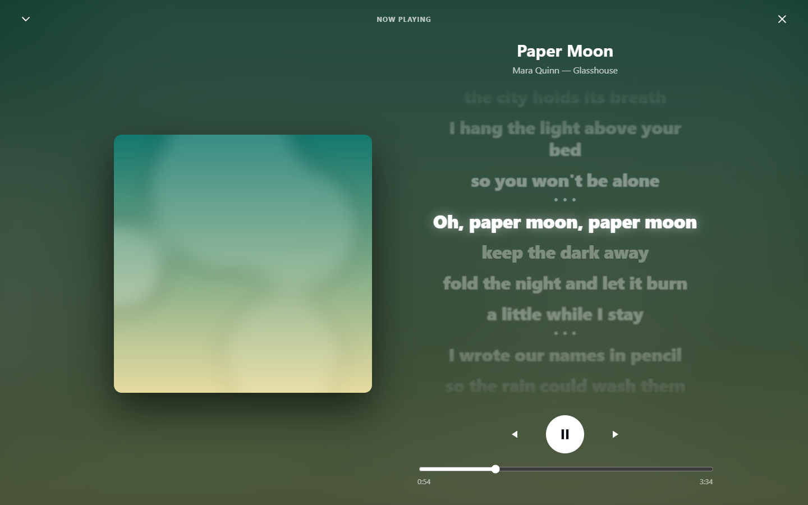

# SoundStorm user guide

Everything beyond the [README](../README.md)'s getting-started steps.

- [Finding your way around](#finding-your-way-around)
- [Adding media](#adding-media)
- [Music](#music)
- [Films and TV](#films-and-tv)
- [Books](#books)
- [Photos](#photos)
- [Favorites, playlists and selecting](#favorites-playlists-and-selecting)
- [Downloads and offline](#downloads-and-offline)
- [Deleting things](#deleting-things)
- [People and permissions](#people-and-permissions)
- [On your phone, TV or another computer](#on-your-phone-tv-or-another-computer)
- [Away from home](#away-from-home)
- [Keeping the library on another drive](#keeping-the-library-on-another-drive)
- [Updating](#updating)
- [Backing it up](#backing-it-up)
- [Forgotten your password](#forgotten-your-password)
- [Moving to another computer](#moving-to-another-computer)
- [Uninstalling](#uninstalling)
- [Security and HTTPS](#security-and-https)
- [Advanced settings](#advanced-settings)

## Finding your way around

The tabs are along the bottom of a phone and down the side of a computer:
**Home**, **Music**, **Watch** (films and TV), **Books** (audiobooks, ebooks,
documents), **Photos** and **Settings**. A tab with nothing in it is hidden.

**Home** starts with what you're part way through (**Continue**), then what you
played recently, what's new on every shelf, and your favorites. Typing in the
search box on Home searches everything. On any other page it searches that page.

Each tab has a row of categories along the top (Music has Mixes, Radio,
Playlists, Songs, Albums, Artists...). Swipe sideways to move between them.
**Hold a category and slide it** to reorder the row, or drag it onto the **+**
at the end to put it away; the **+** brings it back.

**Settings** has its own categories and its own search: type "lyrics" or
"password" to find the right card.

The phone's **back** gesture steps back through the app (closing a menu, the
player, a page) before it leaves it.

## Adding media

**Drag files or folders onto the window**, anywhere. SoundStorm works out which
shelf each belongs on and files it tidily:

- Music is filed as `Artist/Album/song`, and audiobooks and ebooks as
  `Author/Title/`, whatever shape the drop had. Names come from the files' own
  tags where they have them.
- A film's subtitles and poster travel with it.
- **Photos and videos from a phone or camera** go into your own photo folder,
  sorted by when they were taken (see [Photos](#photos)).
- **A zip** is looked inside without unpacking it: a photo download (Google,
  Apple, Facebook and the rest) is brought into your photos; any other zip is
  not unpacked, and a message says so.
- **When it can't tell, it asks**, once per folder: whether an MP3 is a song or
  an audiobook chapter, whether a PDF is a book or a document, and whether a
  folder of unnumbered videos is a series.
- **A song you already have isn't added twice**, even under another name,
  because SoundStorm compares the recording itself. A clean and an explicit
  version, or a remaster, are both kept.
- Anything it can't place is listed with the reason.

On a phone, use **Settings → Add media**. Dropped files are searchable within
seconds.

**Copying into the folders yourself** works too, and suits a whole drive of
media. The layout is shown in the [README](../README.md#getting-started). Files
added this way are found on the next sweep: every minute or two, or at once with
**Settings → Check for new files**.

An existing **Calibre library** can be the ebooks folder as it is: SoundStorm
reads Calibre's metadata, series and covers.

If the drive gets low on space (under 25 GB), a line says how much is left.
SoundStorm always keeps the last 1 GB free, so it never fills the disk.

## Music

**Music** opens on **Mixes**: your most played, recently played, Rediscover
(favorites you haven't played lately), shuffle everything, recently added, and
one per genre and decade. At the top, **your year in music** recaps your
listening like a story: top artists, songs and albums, when you listen, your
longest streak, and more.

**Radio** plays without end. Choose a station (Library radio, Deep cuts, Time
travel, Discovery), a **mood** (Chill, Feel good, Melancholy, Intense, Party,
Focus), or start one from any song, album or artist. **Build a station** to set
how familiar, which decades and genres, and how energetic. Songs are spread out
so no artist plays twice in a row. The first time, SoundStorm listens to your
whole library in the background to learn how each song sounds; that takes a
few hours for a big library, and moods fill in as it goes.

**Artists and albums** are your folders, so a guest appearance doesn't create a
new artist, and an album doesn't split because its tracks disagree about the
year.

### Now Playing

Playing a song opens **Now Playing**, with the lyrics lit up as they're sung
(on a computer, beside the cover).



- **Swipe sideways** anywhere to go to the next or previous song.
- **The Looks button** at the top of Now Playing opens a sheet of every look,
  in two groups. Tap one to switch to it. **Double-tap** the screen on a phone
  to move to the next look.
  - **Lyrics and covers:** **Lyrics** (the default: the song's words, the line
    being sung in the middle), the cover, a spinning disc, and a **record**
    with the cover as its label and the song, artist and album printed round
    it.
  - **Visualizers**, full screen behind the title and controls, moving to the
    actual song - its beats, the bass and sharp hits, how loud it is - in the
    cover's colours: **Orb**, **Spectrum**, **Warp**, **Waves**,
    **Kaleidoscope**, **Fireworks**, **Flow**, **Storm** (rain, clouds and
    lightning), **Synthwave**, **Galaxy**, **Aurora**, **Lava**, and
    **Analysis**, which shows what SoundStorm heard in the song.
  - **Timing** in the same sheet nudges the visualizers earlier or later if
    they look out of step with the sound on this device.

  Your choice is remembered on every device.
- **Hold anywhere** to show every option as icons over the cover: info, sleep
  timer, favorite, shuffle, add to playlist, repeat, download, up next, and
  **songs like this**. Slide onto one and let go to use it.
- **Up next** lists the queue. Hold a song and drag it to reorder.
- Drag Now Playing down, or tap the arrow, to go back to your library while the
  music plays on. The **X** stops the music.

A small player floats at the bottom while something plays. On a phone,
**swipe it up** for Now Playing, **swipe it down** to stop, and **hold it** for
its menu.

**Also:**
- **Lock screen and headphones.** The song, artist and cover show on the lock
  screen, and play, pause and skip work from there, from Bluetooth headphones
  and from a car.
- **Gapless and crossfade.** Songs flow into each other with no gap; turn on
  crossfade under **Settings → Playback on this device**.
- **Data saver.** Stream at a lower quality on this device, or only on mobile
  data.
- **Even volume.** Songs with ReplayGain tags play at the same loudness.
- **Sleep timer.** Stop after 15 minutes to an hour, a time of your own, or at
  the end of the song, fading out. It works with the screen off.
- **Keep the screen on.** Under **Settings → Playback on this device**: off,
  while Now Playing is open (for watching the visualizers), or always while the
  app is open. Set on each device separately.

iPhones don't let a web page set the volume, so crossfade and even volume don't
work there.

### Lyrics

Lyrics show whenever a song has them: a `.lrc` file beside the song, or lyrics
in its tags. For songs without any, the owner can turn on **Find missing lyrics
online** in Settings. SoundStorm then asks [LRCLIB](https://lrclib.net) the first
time each song plays, sending only its artist, title, album and length.
[LRCGET](https://github.com/tranxuanthang/lrcget) can fill a whole library with
`.lrc` files at once.

### Artist pages and discovery

With **music discovery** turned on (Settings, owner only; off by default),
artist pages get a short biography and **similar artists in your library**, and
Radio gets Discovery radio and "More like" mixes. The bio comes from Wikipedia,
and similar artists from [MusicBrainz](https://musicbrainz.org) and
[ListenBrainz](https://listenbrainz.org). Only artists already in your library
are ever looked up.

### Scrobbling

**Settings → Scrobbling**: paste your [ListenBrainz](https://listenbrainz.org)
user token, and every play from any device is sent to your ListenBrainz
profile, including plays made while it was unreachable. Each person connects
their own account.

## Films and TV

**Watch** has **Films** and **TV**. A show opens on its episodes, season by
season, with how far you got in each, and one button for what to watch next.
When an episode ends, the next one starts after a short countdown.

Anything plays: files a browser can't decode are converted as they play, and
seeking still works. **Subtitles** (embedded or beside the file) and a choice
of **audio language** are in the player; each track says what it is, for
example "English · Dolby TrueHD Atmos 7.1". **Continue** on Home remembers
where you stopped, for each person separately.

**Picture quality** is set for each device under **Settings → Playback on this
device → Film quality**: *Smart* (the original at home, lighter away from home;
the default), *Always original*, *Standard* (about 20 Mbps) or *Data saver*
(720p). The **Quality** button in the player changes it for the film you're
watching, and the next episode. **Downloading** a film asks which quality, and
which audio language when there's more than one.

## Books

**Books** has **Audiobooks**, **Ebooks** and **Documents**, plus **Authors**
and **Series** across both kinds of book.

- **Audiobooks** play with a speed control (0.75x to 3x) and a sleep timer.
  **Chapters** opens the book's table of contents. The timeline is the
  chapter you're in, with the whole book's progress under it; the skip buttons
  go back and on thirty seconds, and a swipe moves to the next or previous
  chapter. Books play a little quieter than songs, since they're mastered loud
  (change it under **Settings → Playback on this device**). Your place is
  kept, and it's the same place the Audiobookshelf phone app uses.
- **Ebooks** (EPUB and PDF) open in the reader. Swipe or tap the sides to turn
  pages. Your place is kept across devices. You can read while music plays.
- **Read along** lists every book you have both as an ebook and as an
  audiobook. Tap one: the audiobook plays and the book opens, turning the pages
  and highlighting the sentence being read. Each book is prepared once in the
  background (about 40 minutes for a 10-hour book). The screen stays on while
  it follows. If a book and an audiobook weren't matched, the owner can pair
  them from the book's hold menu; a wrong match can be undone the same way.

## Photos

**Photos** shows your pictures newest first, with **People**, **Places** and
**On this day**. Search by what's in a picture. Tap one to open it:

- **Phone:** swipe between photos, swipe down to close, and pinch or
  double-tap to zoom.
- **Computer:** arrow keys, the mouse wheel to zoom, and Escape to close.

**Download original** gives you the untouched file, and videos play in the
player. You can name somebody the photo server found but couldn't name, from
their page.

**Everyone has their own photos.** What each person adds goes into their own
folder (`pictures/Personal/<name>/`), sorted by year and month taken, and they
see only their own; the owner sees everybody's. **Settings → Your photos** says
how much space you've used. The owner sets each person's space under
**Settings → People** (100 GB unless changed); the owner's own has no limit.

**Phone backup.** In the Android app, **Settings → Your photos → Back up this
phone's photos** sends new photos and videos to your folder in the background:
on Wi-Fi only unless you untick it, videos too unless you untick that, and
only while charging if you ask. It shows how far it has got, and photos
already on the server are never sent twice.

**Bring your photos in from anywhere.** Under **Settings → Your photos**, each
place your photos might be has its own steps: Google Photos (Takeout), iCloud,
Facebook, Instagram, Snapchat Memories, Flickr, OneDrive, Dropbox or Amazon
Photos, WhatsApp and Telegram, and SD cards, cameras, old phones and computers.
Download your photos from the service as zips and drop them anywhere on the
window. Each photo is filed by when it was taken, with its date and place kept
(written beside it, never changing the photo itself), and a photo you already
have is skipped - if the copy coming in knows its date or place better, the
one you have is corrected. Big downloads carry on where they stopped if the
connection drops.

**Keeping your own folders.** Dropped photos are always sorted by date. To keep
an arrangement of folders, copy them straight into your folder on the server's
drive; they appear as they are and are left alone.

## Favorites, playlists and selecting

**Hold down on anything** on a phone, or **right-click** on a computer, for its
menu: favorite, add to playlist, play next, add to queue, download, info and more.
A menu can be used without lifting your finger: slide onto an option and let go.

**Selecting several:** in a list, holding an item selects it. Keep your finger
down and slide across others to select them too, or lift and tap more. Then
**hold any selected item** for the menu for all of them.

**Your own covers.** Don't like a cover? Hold a song and choose **Change
cover**, then **For this song** or **For the whole album**, and pick a picture.
Albums have it in their menu too. The picture is cropped square and shown
everywhere for you: lists, Now Playing, the lock screen. Nobody else in the
house sees it. **Use the original cover** in the same menu puts it back.

**Favorites** can be anything (songs, films, books, photos). Every tab has a
Favorites category, and Home has a row for each.

**Playlists** are for songs, on **Music → Playlists**:
- Tap the shuffle button on a playlist's cover to play it shuffled.
- Each playlist has its own **Sort**: A to Z, Artist, Recently added, or Custom
  order, where you drag songs into place.
- A song is only ever in a playlist once.

**Import playlists** from the Playlists page:
- **From Plex or Plexamp**: sign in on Plex's page, tick the playlists, and
  they come across.
- **From a file**: M3U or M3U8, as saved by Plex tools, iTunes, Jellyfin and
  most players.

Songs are matched to your library by file location, then by artist, title and
length. Any that aren't in your library are listed afterwards.

Favorites, playlists and history belong to each person.

## Downloads and offline

**Download** songs, albums, playlists, audiobooks, ebooks, films, episodes and
photos from their menus. **Settings → Downloads** has **Download all** for a
whole shelf, and manages what's on the device. Downloaded things always play
from the device, and show a small green tick.

Without a connection, SoundStorm keeps working and shows only what's downloaded.
On the secure `….soundstorm.dev` address it even opens with no connection at
all. Signing out removes downloads from that device.

## Deleting things

Only the owner can delete, because everyone shares the same shelves. Hold an
item (or select several) and choose **Delete from library**. It first says
exactly what goes ("1 file, 321 KB") and offers **Undo** afterwards.

Nothing is deleted straight away. Files go into a hidden bin,
`library/.trash`, for 30 days, then the bin empties itself. To get something
back after the Undo has gone, look in `library/.trash`: each delete is a folder
holding the files where they were.

A film takes its whole folder (subtitles and poster too), and an audiobook its
book folder. A song goes on its own, unless it was the last in its album.

## People and permissions

The first account is the **owner**. **Settings → People** adds everyone else
with a name and a password. There's no open sign-up and no invite links: a
stranger can't create an account.

**Tick which shelves each person can see**: untick Films for a child and the
tab disappears, search stops finding films, and the files can't be reached
directly either. The unit is a whole shelf ("no films"), not individual titles.

Everyone has their own favorites, playlists, history, recap, and place in every
film and book - and their own **photos**, which only they and the owner can
see. The owner sets each person's photo space here (100 GB unless changed; the
household default can be changed too).

**Passwords:**
- Changing your own password asks for the current one and signs you out
  everywhere else.
- When the owner resets someone's password, that person is signed out
  everywhere.
- Repeated wrong passwords make the sign-in wait. A device you've signed in on
  before is never held up by somebody else guessing.

## On your phone, TV or another computer

Use the computer's address with port 8099, for example
`http://192.168.1.50:8099`. **Settings → Use on your phone or TV** shows it with
a Copy button.

Within a minute of starting, SoundStorm also gets a secure address like
`https://k3x9m2p7qa.home.soundstorm.dev:8099`, which it moves to by itself.

**The apps:**
- **Android** (phones, and Google TV, Android TV and Fire TV): the newest
  `android-` file on the [releases page](https://github.com/GabrielHollberg/soundstorm/releases).
  Music plays like any music app's, with the lock screen, Bluetooth and car
  controls, and it can back up the phone's photos. On a TV it's driven by the
  remote: the arrows move, OK plays, Back goes back.
- **iPhone** and **Apple TV**: SoundStorm apps (in testing). The Apple TV app
  plays music with every visualizer, films, audiobooks, photos and books.

**Or install the web app:**
- **iPhone:** Share → Add to Home Screen.
- **Android:** Chrome menu → Install app. This only works from the secure
  address.

Worth doing:
- **Give the computer a fixed address** in your router (a DHCP reservation).
- **If a phone can't connect**, check it's on the same Wi-Fi and not a guest
  network. On Windows, run **Update SoundStorm** while on your home network: it
  marks the network private and opens SoundStorm's port in the firewall.

## Away from home

The secure `….home.soundstorm.dev` address only works on your own Wi-Fi, on
purpose. For everywhere else there are two ways.

### Remote access

Turn it on under **Settings → Reach it from anywhere** (or install with
`-Remote` on Windows, `--remote` on Mac and Linux). Your server gets a second
address, `https://….net.soundstorm.dev:8099`, with a trusted certificate. Share
the link and people reach your sign-in page, with no app to install.

- **SoundStorm opens the port on your router itself** where the router allows
  it (PCP, NAT-PMP or UPnP).
- **Where it can't**, the panel says exactly which port to forward to which
  computer, and shows when it starts working.
- **Where forwarding is impossible**, because your provider shares one address
  between many homes (carrier-grade NAT), it says so and points you to
  Tailscale.
- **Over IPv6** there is nothing to forward.

It's **off by default**, because once it's on your sign-in page faces the
internet. Guessing passwords there is slow by design. Include the `:8099` when
typing the address.

### Tailscale

[Tailscale](https://tailscale.com) connects your devices privately, with nothing
exposed to the internet and no port forwarding, on any connection. It needs a
free Tailscale account and the Tailscale app on each device.

- **Windows:** Start menu → **Set up Tailscale**, which walks you through it.
- **Mac and Linux:**
  ```sh
  curl -fsSL https://raw.githubusercontent.com/GabrielHollberg/soundstorm/main/install.sh | sh -s -- --tailscale --auth-key tskey-...
  ```

SoundStorm then answers at `https://soundstorm.<your-tailnet>.ts.net`.
`--no-tailscale` turns it off again.

## Keeping the library on another drive

Run the installer again with a library folder.

**Windows:**
```powershell
& "$env:USERPROFILE\SoundStorm\soundstorm.ps1" -Library "E:\Media"
```
(or Start menu → **Move SoundStorm library**, which lets you pick the folder)

**Mac and Linux:**
```sh
curl -fsSL https://raw.githubusercontent.com/GabrielHollberg/soundstorm/main/install.sh | sh -s -- --library /mnt/media
```

Files already in the old library stay where they are: move them across
yourself while SoundStorm is stopped. Keep the drive connected. On Linux, mount
it at boot, because an unmounted drive looks to the media servers like an
emptied library. Network drives can't be used on Windows.

## Updating

- **Windows:** Start menu → **Update SoundStorm**.
- **Mac and Linux:** run the install command again.
- **By hand:** `docker compose pull && docker compose up -d` in the install
  folder.

Your library, accounts and settings are kept.

## Backing it up

One file holds every account, everyone's favorites and playlists, and the
passwords SoundStorm made for the media servers. (It doesn't hold everyone's
year-in-music listening log or the covers and playlist pictures people chose;
those stay in SoundStorm's data and move with it to another computer.) **Those passwords exist
nowhere else.** Keep a copy somewhere other than this computer, and treat it
like a password.

In the install folder:

**Mac and Linux:**
```sh
(umask 077; docker compose run --rm -T soundstorm backup - > soundstorm-backup.json)
```

**Windows** (PowerShell):
```powershell
docker compose run --rm -v "${PWD}:/backup" soundstorm backup /backup/soundstorm-backup.json
```

To restore, on a new computer or after a reset:

```sh
docker compose run --rm -T soundstorm restore - < soundstorm-backup.json     # Mac and Linux
docker compose run --rm -v "${PWD}:/backup" soundstorm restore /backup/soundstorm-backup.json   # Windows
docker compose up -d
```

Restoring refuses anything that isn't a SoundStorm backup, and keeps what it
replaced as `state.json.bak`. The uninstaller saves a backup automatically before
removing anything.

## Forgotten your password

In the install folder:

```sh
docker compose down
docker compose run --rm soundstorm reset-password
docker compose up -d
```

It prints a new password. With more than one account, add the name:
`reset-password alex`. Stopping first matters: a running SoundStorm would
overwrite the reset. Nothing else changes.

## Moving to another computer

SoundStorm packs everything (accounts, playlists, positions, the media servers'
data, and optionally your media) into one folder, to carry over on a USB drive
or the network, between Windows, Mac and Linux in any direction.

- **Windows:** Start menu → **Move SoundStorm to another computer**.
- **Mac and Linux:**
  ```sh
  curl -fsSL https://raw.githubusercontent.com/GabrielHollberg/soundstorm/main/install.sh | sh -s -- --export /media/usb
  ```
  (add `--no-library` to leave the media out)

On the new computer, open the `SoundStorm-move` folder and run
**Install SoundStorm here.cmd** (Windows) or `sh install-here.sh` (Mac, Linux).
Then uninstall it from the old computer. File names Windows can't hold are
listed in `windows-name-problems.txt` so they can be renamed first.

## Uninstalling

- **Windows:** Settings → Apps → **SoundStorm** → Uninstall.
- **Mac and Linux:**
  ```sh
  curl -fsSL https://raw.githubusercontent.com/GabrielHollberg/soundstorm/main/install.sh | sh -s -- --uninstall
  ```

This removes SoundStorm and the media servers' data. **Your media is never
touched**: the `library` folder stays, and the uninstaller says where. Docker
stays installed.

## Security and HTTPS

**HTTPS is on by default, with nothing to do.** Each install gets its own
`….home.soundstorm.dev` name and a certificate from Let's Encrypt, which every
browser trusts. The name service only knows your server's home network address.
Your media, searches and passwords never go near it. If it's ever down,
SoundStorm carries on with the certificate it has.

If your router refuses the name (some do), SoundStorm simply stays on the plain
address.

**Other choices**, set in the `.env` file in the install folder, then
`docker compose up -d`:
- `SOUNDSTORM_TLS=off`: plain http only.
- `SOUNDSTORM_TLS=self-signed`: no outside service. Every device warns until
  you install `https://<server>:8099/ca.crt` on it.
- `SOUNDSTORM_TLS=file` with `SOUNDSTORM_TLS_CERT` and `SOUNDSTORM_TLS_KEY`:
  your own certificate.
- Behind a reverse proxy that handles TLS: leave TLS off and set
  `SOUNDSTORM_TRUST_PROXY=true`.

If the server's address changes, update `SOUNDSTORM_TLS_HOSTS` in `.env` (the
installer does this for you on Windows), or give the computer a fixed address.

SoundStorm hasn't had an independent security audit. Its own security reviews
are recorded in the repository. Putting any home server on the internet is a
decision worth making deliberately, which is why remote access is off until you
turn it on.

## Advanced settings

Settings live in the `.env` file beside `docker-compose.yml`. After changing
it, run `docker compose up -d`.

| Setting | What it does |
| --- | --- |
| `SOUNDSTORM_PORT` | The port (default 8099) |
| `SOUNDSTORM_LIBRARY_PATH` | Where the library lives |
| `SOUNDSTORM_TLS` | `auto` (default from the installers), `off`, `self-signed`, `file` |
| `SOUNDSTORM_TLS_HOSTS` | The server's LAN address(es), for the secure name |
| `SOUNDSTORM_SETUP_CODE` | The code the first sign-up needs |
| `SOUNDSTORM_REMOTE_ACCESS` | `on` to reach it from anywhere (also a switch in Settings) |
| `SOUNDSTORM_TRUST_PROXY` | `true` behind your own reverse proxy that terminates HTTPS |
| `SOUNDSTORM_IMAGE` | Which SoundStorm image to run, to hold a specific version |

Useful commands, in the install folder:

```sh
docker compose logs -f soundstorm   # what it's doing
docker compose down                 # stop (nothing is lost)
docker compose up -d                # start
```

Windows specifics: the setup installs Docker Desktop with `winget`, starts it
when needed, picks the next free port if 8099 is taken, and adds desktop, Start
menu and start-up shortcuts. It keeps a log at `%TEMP%\SoundStorm-setup.log`.
